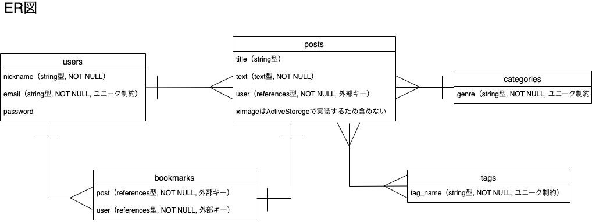
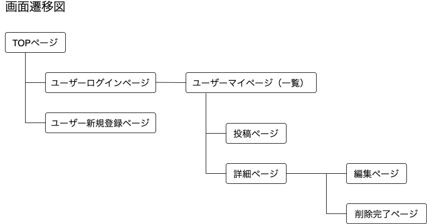

# README

## アプリケーション名
Note To Self +
  

## アプリケーション概要
テキストや画像の投稿が手軽に出来る。
個人用の備忘録やアイディアノートとしての使用を想定している。
  

## URL
https://note-38690.onrender.com
  

## テスト用アカウント
メールアドレス：admin@mail  
パスワード：admin1234
  

## 利用方法

### 投稿機能
１.トップページのヘッダーからユーザー新規登録を行う  
２.投稿するリンクから投稿内容（本文、カテゴリー、画像、タイトル、タグ）を入力し送信する  
３.投稿記事が一覧表示に追加され、編集、削除、詳細、ブックマークが利用出来る
  

## アプリケーションを作成した背景
個人用の備忘録として、手軽に使用できる投稿アプリが欲しくて作成した。  
投稿した記事は、何度も見返すことを前提としている為、見返すことが楽しくなるようなデザインを目指した。
  

## 洗い出した要件
[要件を定義したシート](https://docs.google.com/spreadsheets/d/1tOHrH6x2cKGG1QWYOD6DwPMzVGX6YTGKYbHs33ZSRYE/edit#gid=982722306)
  

## 実装予定の機能
今後は、検索機能とサイドバーを実装予定。
  

## データベース設計

  

## 画面遷移図

  
